# Lambda Business Logic Flowcharts

Visual documentation of the business logic, validation, decision trees, and error handling within each Lambda function in the User Data Platform.

## Table of Contents

- [Shared Middleware Pipeline](#shared-middleware-pipeline)
- [Error Handling](#error-handling)
- [Identity Management](#identity-management)
  - [createUserLambda](#createuserlambda)
  - [createIdentityLambda](#createidentitylambda)
  - [readIdentityLambda](#readidentitylambda)
  - [exchangeIdentityLambda](#exchangeidentitylambda)
  - [getAllLinkedServiceLambda](#getalllinkedservicelambda)
  - [deleteIdentityLambda](#deleteidentitylambda)
- [Data Management](#data-management)
  - [postDataLambda](#postdatalambda)
  - [getDataLambda](#getdatalambda)
  - [patchDataLambda](#patchdatalambda)
  - [deleteDataLambda](#deletedatalambda)
- [SAR Pipeline (Subject Access Request)](#sar-pipeline-subject-access-request)
  - [SAR Pipeline Overview](#sar-pipeline-overview)
  - [startSarLambda](#startsarlambda)
  - [createSarFileLambda](#createsarfilelambda)
  - [generateSarPresignedUrlLambda](#generatesarpresignedurllambda)
  - [getSarStatusLambda](#getsarstatuslambda)
- [DSAR Pipeline (Data Subject Access Request / Deletion)](#dsar-pipeline-data-subject-access-request--deletion)
  - [DSAR Pipeline Overview](#dsar-pipeline-overview)
  - [startDsarLambda](#startdsarlambda)
  - [dsarRequestLambda](#dsarrequestlambda)
  - [dsarDeleteLambda](#dsardeletelambda)

---

## Shared Middleware Pipeline

All API Gateway Lambdas use the [Middy](https://middy.js.org/) middleware framework. The middleware chain runs `before` hooks top-to-bottom on the request, then `after` hooks bottom-to-top on the response. The `onError` handler wraps the entire lifecycle.

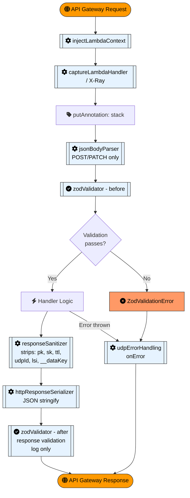

> **Note:** SQS-triggered Lambdas (createSarFile, dsarRequest, dsarDelete) and the S3-triggered Lambda (generateSarPresignedUrl) use a minimal middleware stack: `injectLambdaContext` + `captureLambdaHandler` only.

---

## Error Handling

The `udpErrorHandling` middleware maps error types to HTTP responses:

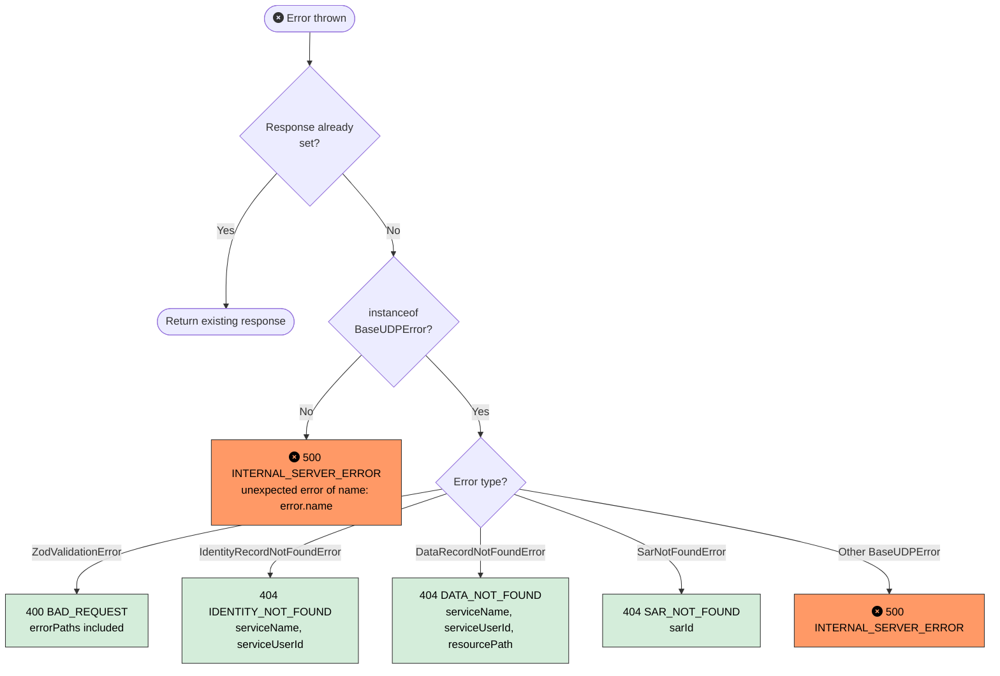

---

## Identity Management

### createUserLambda

**Route:** `POST /v1/user`

Creates a new app user. Silently succeeds if the user already exists (idempotent).

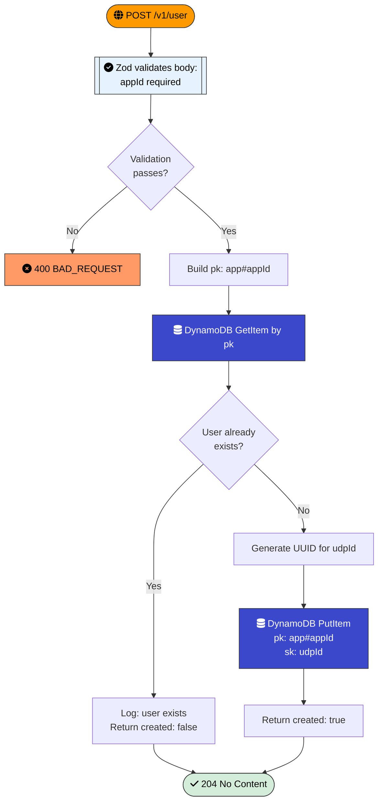

### createIdentityLambda

**Route:** `POST /v1/identity/{serviceName}/{identifier}`

Links a service identity to an existing app user. Validates that appId and serviceId are not the same.

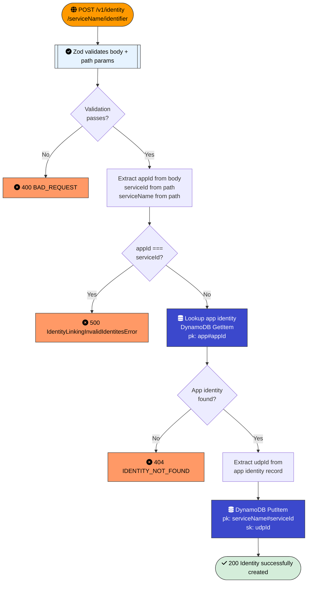

### readIdentityLambda

**Route:** `GET /v1/identity/{serviceName}/{identifier}`

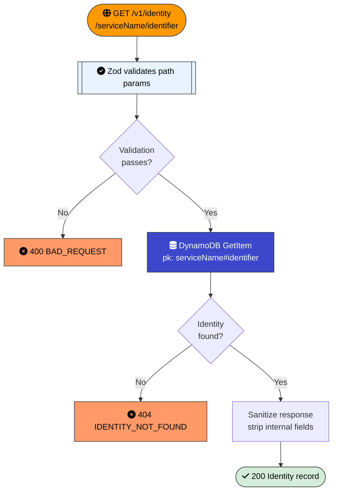

### exchangeIdentityLambda

**Route:** `GET /v1/exchange-identity?requiredService={service}`

Looks up a linked identity for a different service via the `sk-index` GSI.

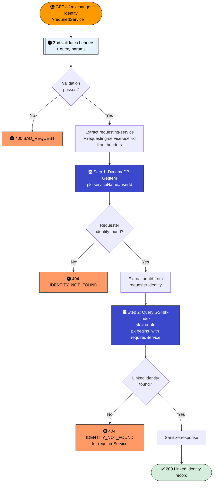

### getAllLinkedServiceLambda

**Route:** `GET /v1/identity/{serviceName}/{serviceId}/linked-services`

Returns all service names linked to the same UDP user via the shared `udpId`.

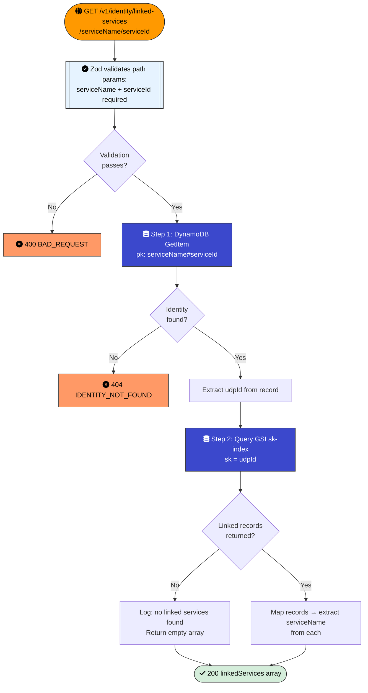

### deleteIdentityLambda

**Route:** `DELETE /v1/identity/{serviceName}/{identifier}`

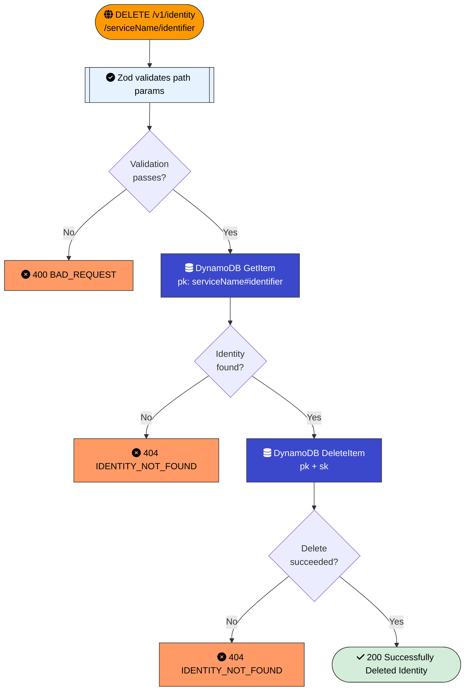

---

## Data Management

### postDataLambda

**Route:** `POST /v1/data/{resourcePath}`

Stores user data against an identity. Supports optional TTL configuration.

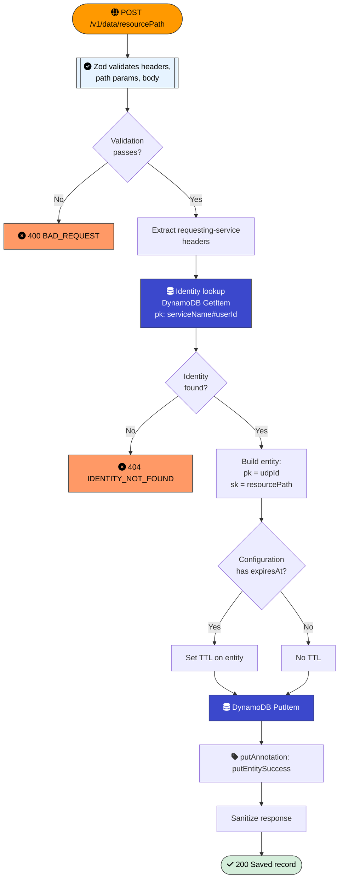

### getDataLambda

**Route:** `GET /v1/data/{resourcePath}`

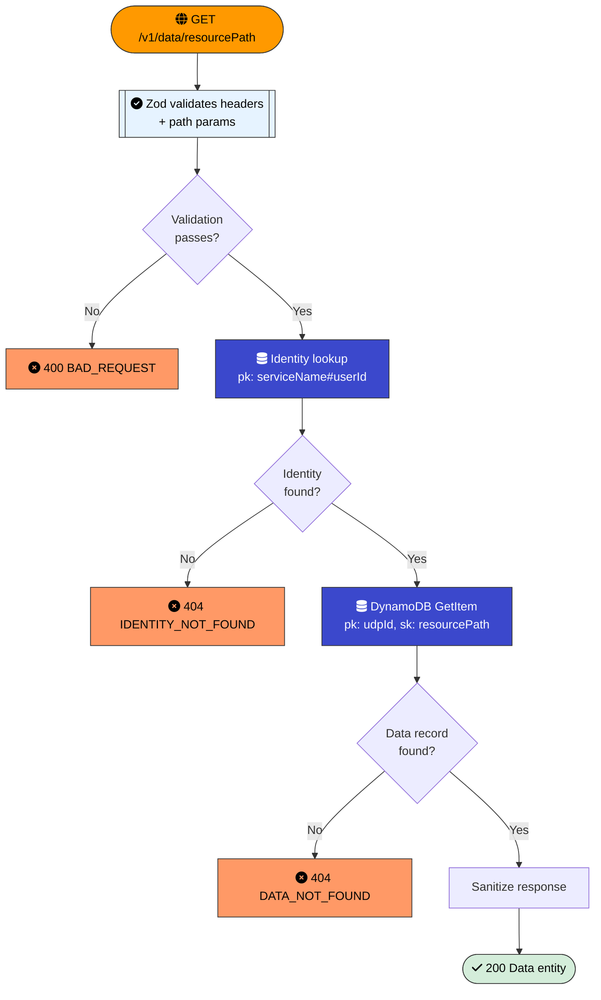

### patchDataLambda

**Route:** `PATCH /v1/data/{resourcePath}`

Performs a deep merge of the request body with the existing data record. Objects are recursively merged; primitives and arrays are overwritten.

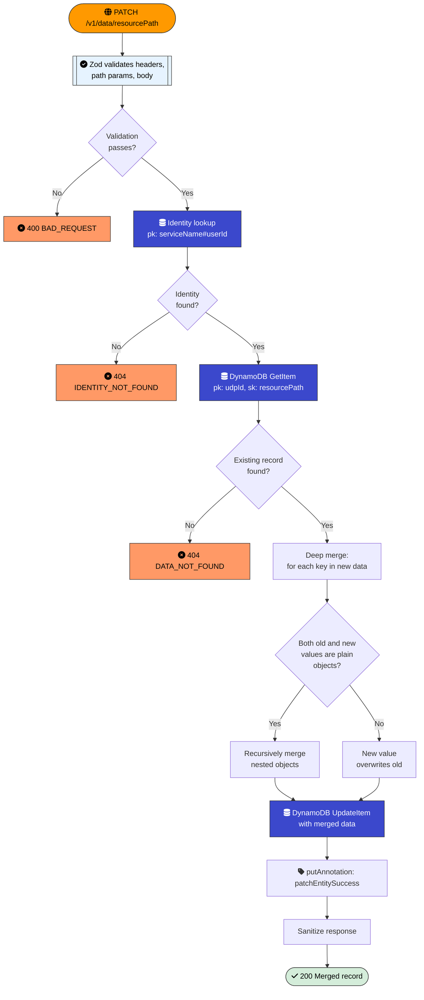

### deleteDataLambda

**Route:** `DELETE /v1/data/{resourcePath}`

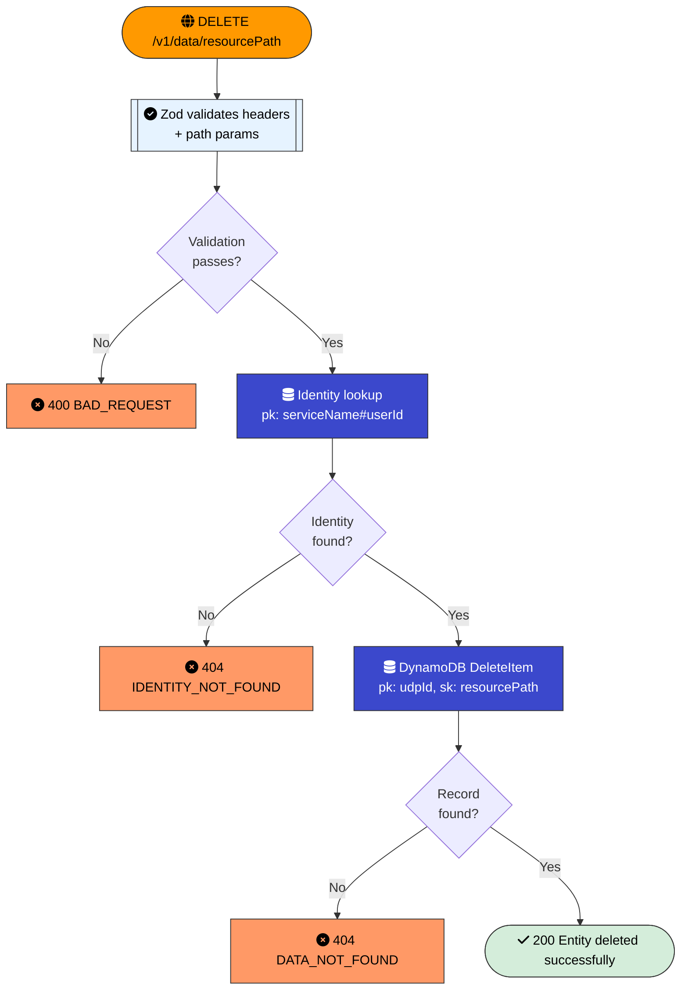

---

## SAR Pipeline (Subject Access Request)

### SAR Pipeline Overview

The SAR pipeline generates a downloadable file containing all of a user's data. It spans four Lambdas connected via SQS and S3 events.

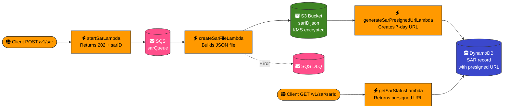

### startSarLambda

**Route:** `POST /v1/sar`

Initiates a Subject Access Request by sending a message to the SAR processing queue.

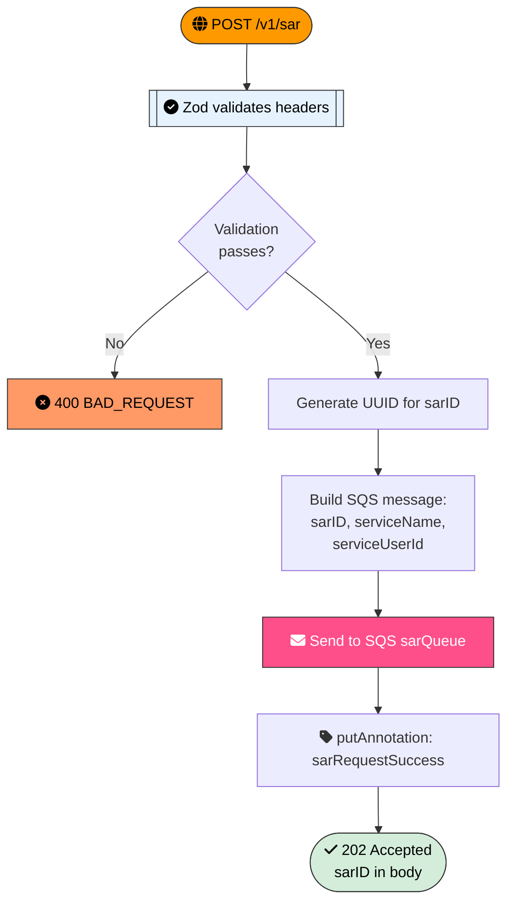

### createSarFileLambda

**Trigger:** SQS event from sarQueue (batch size: 1)

Collects all user data, sanitizes it, and uploads to S3. On error, manually sends the message to a DLQ rather than relying on SQS retry.

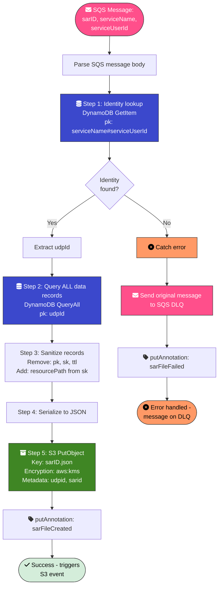

### generateSarPresignedUrlLambda

**Trigger:** S3 ObjectCreated event

Generates a pre-signed download URL and creates a SAR record in DynamoDB with expiry timestamps. On error, re-throws to trigger Lambda retry (different error strategy from createSarFileLambda).

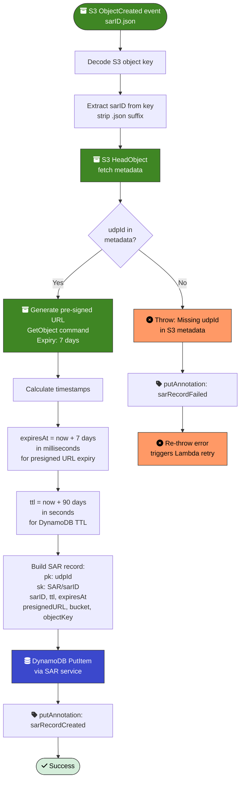

### getSarStatusLambda

**Route:** `GET /v1/sar/{sarId}`

Retrieves the SAR record containing the pre-signed download URL.

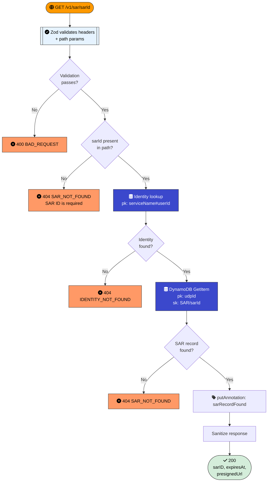

---

## DSAR Pipeline (Data Subject Access Request / Deletion)

### DSAR Pipeline Overview

The DSAR pipeline deletes all of a user's data and identity records. It uses batched pagination to handle large datasets.

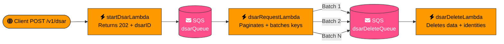

### startDsarLambda

**Route:** `POST /v1/dsar`

Initiates a Data Subject Access Request (deletion) by sending a message to the DSAR processing queue.

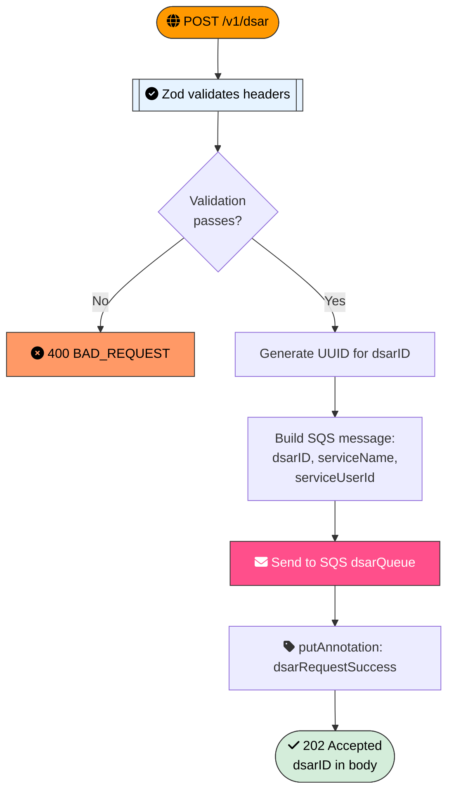

### dsarRequestLambda

**Trigger:** SQS event from dsarQueue (batch size: 1)

Looks up all data keys for a user and sends them in batches of 100 to the delete queue. Short-circuits if no data exists.

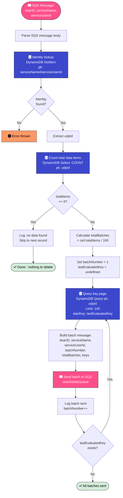

### dsarDeleteLambda

**Trigger:** SQS event from dsarDeleteQueue (batch size: 1)

Deletes data records key-by-key, tolerating already-deleted items. After all data is deleted, removes all linked identity records.

```mermaid

flowchart TD

    classDef error fill:#f96,stroke:#333,color:#000

    classDef success fill:#d4edda,stroke:#333,color:#000

    classDef warn fill:#fff3cd,stroke:#333,color:#000

    classDef sqs fill:#FF4F8B,stroke:#333,color:#fff

    classDef dynamo fill:#3B48CC,stroke:#333,color:#fff


    A([fa:fa-envelope SQS Message:<br/>dsarID, batchNumber,<br/>totalBatches, keys]):::sqs --> B[Parse SQS message body]

    B --> C[Set deletedCount = 0]

    C --> D[For each key in batch]

    D --> E[fa:fa-database DynamoDB DeleteItem<br/>pk: key.pk, sk: key.sk]:::dynamo

    E --> F{Delete<br/>succeeded?}

    F -- Yes --> G[deletedCount++]

    F -- DataNotFoundError --> H[fa:fa-exclamation-triangle Log warning:<br/>item not found<br/>Continue]:::warn

    F -- Other error --> ERR[fa:fa-times-circle Re-throw error]:::error

    G --> I{More keys<br/>in batch?}

    H --> I

    I -- Yes --> D

    I -- No --> J[Log: batch complete<br/>deletedCount]

    J --> K[Extract udpId from<br/>keys 0 .pk]

    K --> L[fa:fa-database Query all identities<br/>by sk = udpId]:::dynamo

    L --> M[fa:fa-database Delete each identity<br/>record]:::dynamo

    M --> N{ConditionalCheck<br/>Failed?}

    N -- Yes --> O[fa:fa-exclamation-triangle Log warning,<br/>continue]:::warn

    N -- No error --> P[Identity deleted]

    O --> Q{More<br/>identities?}

    P --> Q

    Q -- Yes --> M

    Q -- No --> R[Log: identity records deleted]

    R --> S([fa:fa-check Batch complete]):::success
```
